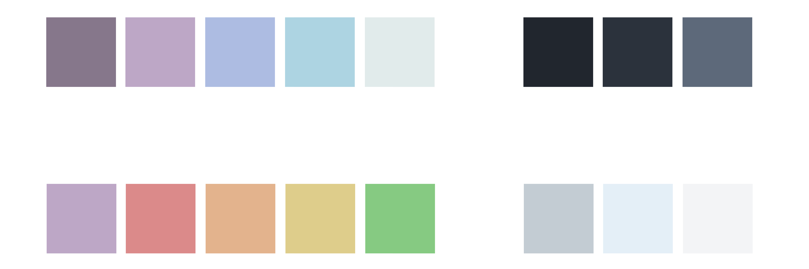

</a>
</a>

The <b>Arctica Color Theme</b> (currently only for VSCode) os a cold, arctic and slighty purple toned color theme, making your code look cleaner.

# Getting Started

At the current state of development the **Arctica Theme** is only available as VSCode color theme. We are planning a full integration for products like Atom, Vim, Shell Themes etc. in the near future. For more you can also look at our [Roadmap](https://trello.com/b/iXfCp0id/arctica-theme).   
You can download the VSCode Color Theme [here](https://marketplace.visualstudio.com/items?itemName=Tentalabs.arctica). 

# Color Palette

 

Copyright © 2022 Tentalabs
  
